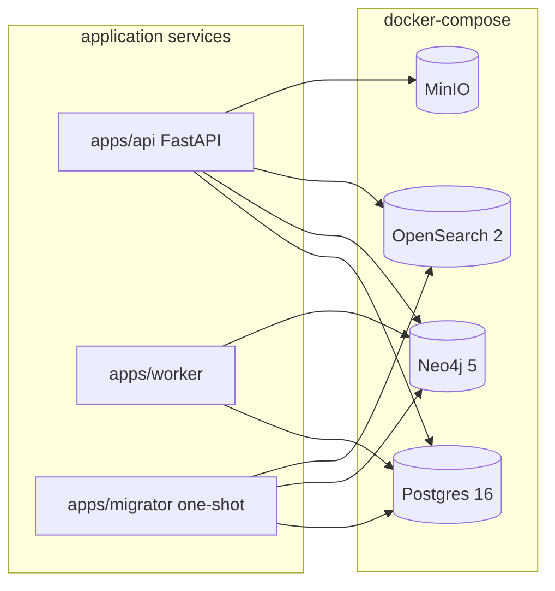

# Architecture — Phase 0

This document sketches the Phase 0 service topology of `civic-proof-il`.
It is a living document: deeper component contracts live in
[`political_verifier_v_1_plan.md`](political_verifier_v_1_plan.md), and current
progress lives in [`PROJECT_STATUS.md`](PROJECT_STATUS.md).

## Topology

All four backing stores run as docker-compose services. `apps/migrator` is a
one-shot container that applies SQL migrations, Neo4j constraints, and
OpenSearch index mappings; it exits when done. `apps/api` and `apps/worker` are
long-running and depend on healthy stores before accepting traffic.

## Component responsibilities

### Applications (`apps/`)

- **`apps/api`** — FastAPI service exposing `/claims/verify`, `/persons/{id}`,
  `/review/tasks`, and `/review/tasks/{id}/resolve`. Orchestrates the claim
  pipeline, never writes canonical facts directly.
- **`apps/worker`** — Background worker that runs ingestion, parsing,
  normalization, entity resolution, and verification jobs; writes to Postgres
  and Neo4j, archives artifacts to MinIO.
- **`apps/migrator`** — One-shot job that applies Postgres migrations, Neo4j
  constraints, and OpenSearch index mappings on startup.
- **`apps/reviewer_ui`** — Deferred to Phase 5; no code in Phase 0.

### Shared packages (`packages/`)

- **`packages/common`** — Shared utilities, settings loader, logging, typed
  helpers used across apps and services.
- **`packages/ontology`** — Canonical Pydantic models for `Person`, `Office`,
  `Committee`, `Bill`, `VoteEvent`, `AtomicClaim`, `Verdict`, `EvidenceSpan`,
  etc., plus the ontology type enums.
- **`packages/clients`** — Thin async clients for Postgres (asyncpg/SQLAlchemy),
  Neo4j, OpenSearch, and MinIO/S3.
- **`packages/prompts`** — Versioned prompt templates for the narrow LLM roles
  (decomposition, temporal normalization, evidence summarization, reviewer
  explanations). Prompts are loaded by version, never inlined in service code.

### Domain services (`services/`)

- **`services/archival`** — Fetches source material, hashes content, assigns
  immutable archive URIs, records fetch metadata. Prerequisite to any verdict.
- **`services/ingestion/gov_il`** — Adapter for gov.il role pages, decision
  records, and official releases.
- **`services/ingestion/knesset`** — Adapter for Knesset people, committees,
  votes, bills, and attendance.
- **`services/ingestion/elections`** — Adapter for official election results.
- **`services/parsing`** — Deterministic parsers turning raw artifacts into
  normalized records (people, offices, committees, memberships, votes,
  sponsorships, attendance).
- **`services/normalization`** — Field-level normalization (names, dates, IDs,
  Hebrew/English transliteration).
- **`services/entity_resolution`** — Resolves names to canonical entities via
  official IDs, exact match, curated aliases, transliteration, fuzzy match, and
  LLM fallback for ties only.
- **`services/claim_decomposition`** — Splits a statement into atomic claims
  using rules first, LLM second, schema validation last.
- **`services/retrieval`** — Graph retrieval plus lexical+vector retrieval over
  archived evidence, with deterministic reranking.
- **`services/verification`** — Deterministic verdict engine, confidence rubric,
  abstention policy. LLMs summarize evidence, never decide truth.
- **`services/review`** — Routes risky cases to reviewers, preserves an audit
  trail, manages override actions.

## Data stores

- **Postgres 16** — Operational tables (`ingest_runs`, `raw_fetch_objects`,
  `parse_jobs`, `normalized_records`, `entity_candidates`, `review_tasks`,
  `review_actions`, `verification_runs`, `verdict_exports`).
- **Neo4j 5** — Canonical knowledge graph of people, parties, offices,
  committees, bills, votes, and the claim/verdict/evidence nodes.
- **OpenSearch 2** — Text indexes for `source_documents`, `evidence_spans`, and
  `claim_cache`, used for lexical+vector retrieval.
- **MinIO** — S3-compatible archive of raw source payloads (HTML, PDF, JSON,
  CSV, text) under the `civic-archive` bucket, keyed by content hash.
