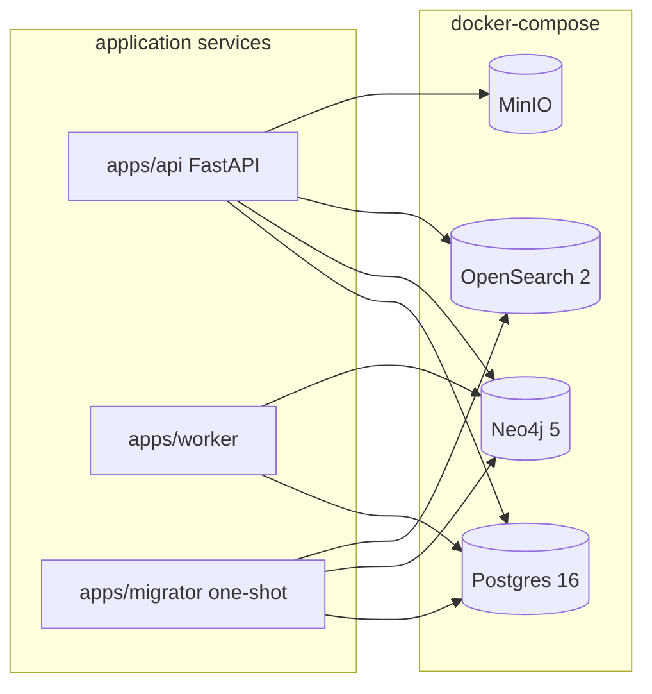
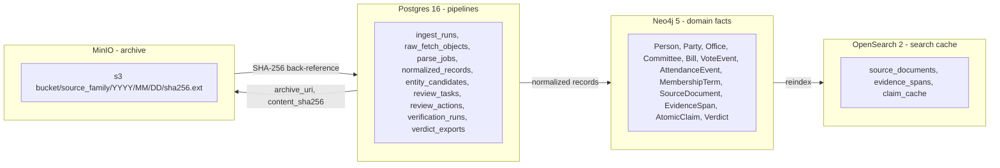
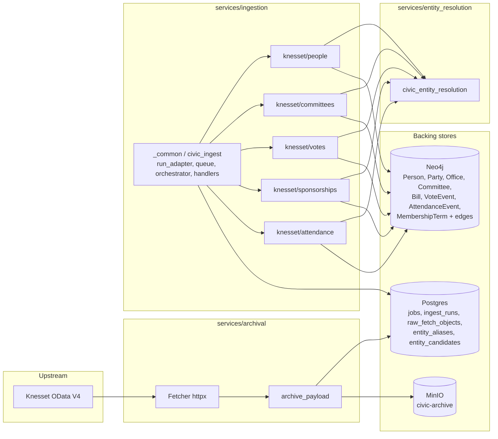
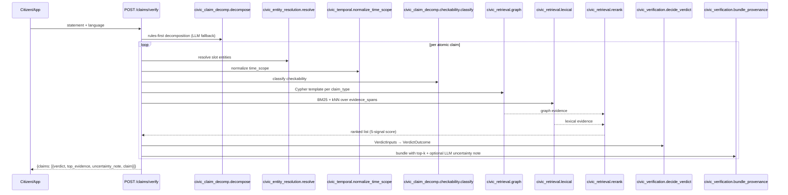

# Architecture — Phase 0

This document sketches the Phase 0 service topology of `civic-proof-il`.
It is a living document: deeper component contracts live in
[`political_verifier_v_1_plan.md`](political_verifier_v_1_plan.md), and current
progress lives in [`PROJECT_STATUS.md`](PROJECT_STATUS.md); pitfalls and
invariants in [`AGENT_GUIDE.md`](AGENT_GUIDE.md).

## Topology

All four backing stores run as docker-compose services. `apps/migrator` is a
one-shot container that applies SQL migrations, Neo4j constraints, and
OpenSearch index mappings; it exits when done. `apps/api` and `apps/worker` are
long-running and depend on healthy stores before accepting traffic.

## Component responsibilities

### Applications (`apps/`)

- **`apps/api`** — FastAPI service exposing `/claims/verify`, `/persons/{id}`,
  `/review/tasks`, and `/review/tasks/{id}/resolve`. Orchestrates the claim
  pipeline, never writes canonical facts directly.
- **`apps/worker`** — Background worker that runs ingestion, parsing,
  normalization, entity resolution, and verification jobs; writes to Postgres
  and Neo4j, archives artifacts to MinIO.
- **`apps/migrator`** — One-shot job that applies Postgres migrations, Neo4j
  constraints, and OpenSearch index mappings on startup.
- **`apps/reviewer_ui`** — Jinja2 + HTMX reviewer queue app (port 8001 in compose). Shipped in Phase 5 with HTTP Basic Auth (`REVIEWER_UI_USER` / `REVIEWER_UI_PASSWORD`) and an HTMX proxy to the main API. See ADR-0009.

### Shared packages (`packages/`)

- **`packages/common`** — Shared utilities, settings loader, logging, typed
  helpers used across apps and services.
- **`packages/ontology`** — Canonical Pydantic models for `Person`, `Office`,
  `Committee`, `Bill`, `VoteEvent`, `AtomicClaim`, `Verdict`, `EvidenceSpan`,
  etc., plus the ontology type enums.
- **`packages/clients`** — Thin async clients for Postgres (asyncpg/SQLAlchemy),
  Neo4j, OpenSearch, and MinIO/S3.
- **`packages/prompts`** — Versioned prompt templates for the narrow LLM roles
  (decomposition, temporal normalization, evidence summarization, reviewer
  explanations). Prompts are loaded by version, never inlined in service code.

### Domain services (`services/`)

- **`services/archival`** — Fetches source material, hashes content, assigns
  immutable archive URIs, records fetch metadata. Prerequisite to any verdict.
- **`services/ingestion/gov_il`** — Adapter for gov.il role pages, decision
  records, and official releases.
- **`services/ingestion/knesset`** — Adapter for Knesset people, committees,
  votes, bills, and attendance.
- **`services/ingestion/elections`** — Adapter for official election results.
- **`services/parsing`** — Deterministic parsers turning raw artifacts into
  normalized records (people, offices, committees, memberships, votes,
  sponsorships, attendance).
- **`services/normalization`** — Field-level normalization (names, dates, IDs,
  Hebrew/English transliteration).
- **`services/entity_resolution`** — Resolves names to canonical entities via
  official IDs, exact match, curated aliases, transliteration, fuzzy match, and
  LLM fallback for ties only.
- **`services/claim_decomposition`** — Splits a statement into atomic claims
  using rules first, LLM second, schema validation last.
- **`services/retrieval`** — Graph retrieval plus lexical+vector retrieval over
  archived evidence, with deterministic reranking.
- **`services/verification`** — Deterministic verdict engine, confidence rubric,
  abstention policy. LLMs summarize evidence, never decide truth.
- **`services/review`** — Routes risky cases to reviewers, preserves an audit
  trail, manages override actions.

## Data stores

- **Postgres 16** — Operational tables (`ingest_runs`, `raw_fetch_objects`,
  `parse_jobs`, `normalized_records`, `entity_candidates`, `review_tasks`,
  `review_actions`, `verification_runs`, `verdict_exports`).
- **Neo4j 5** — Canonical knowledge graph of people, parties, offices,
  committees, bills, votes, and the claim/verdict/evidence nodes.
- **OpenSearch 2** — Text indexes for `source_documents`, `evidence_spans`, and
  `claim_cache`, used for lexical+vector retrieval.
- **MinIO** — S3-compatible archive of raw source payloads (HTML, PDF, JSON,
  CSV, text) under the `civic-archive` bucket, keyed by content hash.

## Phase 1 — Canonical data model

Phase 1 lands the canonical data model across the four backing stores. Each
store has a single, non-overlapping responsibility; canonical business keys
(UUID4 strings) are shared across stores so records can be joined without a
central issuer. The human-readable overview lives in
[`DATA_MODEL.md`](DATA_MODEL.md); the decision record is
[`adr/0001-canonical-data-model.md`](adr/0001-canonical-data-model.md).

**Postgres 16** owns the operational pipeline — ingestion runs, raw-fetch
metadata, parse jobs, normalized-record payloads, entity-resolution candidates,
the review task/action queue, and verification runs with their verdict exports.
Schema lands via Alembic migration
`infra/migrations/versions/0002_phase1_domain_schema.py`. Postgres does not
store domain facts directly; it records pipeline state and carries the
JSONB payloads that feed Neo4j.

**Neo4j 5 (community)** owns all canonical domain facts. Twelve node labels
(`Person`, `Party`, `Office`, `Committee`, `Bill`, `VoteEvent`,
`AttendanceEvent`, `MembershipTerm`, `SourceDocument`, `EvidenceSpan`,
`AtomicClaim`, `Verdict`) and eleven relationships including temporal
`MEMBER_OF` / `HELD_OFFICE` / `MEMBER_OF_COMMITTEE` edges carrying
`valid_from` / `valid_to`. Node identity is enforced by
`REQUIRE n.<entity>_id IS UNIQUE` + `IS NOT NULL` in
`infra/neo4j/constraints.cypher`; all writes go through the idempotent
`MERGE` upsert templates under `infra/neo4j/upserts/`.

**OpenSearch 2** is a derived search + cache index and is not a system of
record. Three index templates under `infra/opensearch/templates/`:
`source_documents` (full-text search over archived source bodies),
`evidence_spans` (substring spans tied back to a document), and `claim_cache`
(fast lookup of normalized atomic claims by speaker / target / bill /
committee / office). OpenSearch can be rebuilt from Neo4j + MinIO without
data loss.

**MinIO** holds immutable raw archive objects keyed by SHA-256 over the raw
bytes. The URI convention — `s3://<MINIO_BUCKET_ARCHIVE>/<source_family>/<YYYY>/<MM>/<DD>/<sha256>.<ext>` —
is specified in
[`conventions/archive-paths.md`](conventions/archive-paths.md). Archive
objects are write-once; the provenance rule "no verdict without an archived
source" is enforced at the verification layer.

JSON Schema contracts live under `data_contracts/jsonschemas/` (Draft
2020-12); Pydantic v2 models in `packages/ontology/` are the single source
of truth, and the committed JSON Schemas are regenerated from the models
with drift enforced by CI.

## Phase 2 — Ingestion pipeline (first family)

Phase 2 lands the ingestion path for the five Knesset entity families
(people/roles, committees/memberships, plenum votes, bill sponsorships,
committee attendance). Adapters are parallel workspace members, each
with the same shape (`parse` → `normalize` → `upsert`), coordinated by
a shared runner and a Postgres-native job queue.

### Services

- **`services/archival/`** — `civic-archival` workspace member. `Fetcher`
  is an `httpx.Client` wrapper with polite defaults (identifying
  `User-Agent`, 10s connect / 30s read timeout, one `Retry-After` honor on
  429) used by every adapter and by the `python -m civic_archival fetch`
  CLI that records VCR cassettes. `archive_payload()` is the single
  write path for the archive: it content-hashes the bytes, short-circuits
  on known digests (`raw_fetch_objects.content_sha256` UNIQUE), uploads
  to MinIO via `civic_clients.minio_client.put_archive_object`, and
  inserts one `raw_fetch_objects` row per new payload. Extension
  inference honours `Content-Type` first, falling back to `bin`.
- **`services/ingestion/_common/`** — `civic-ingest` workspace member.
  Hosts the cross-adapter primitives: `SourceManifest` (Pydantic model
  + loader), `ODataPage` + `parse_odata_page` + `iter_odata_pages`
  helpers, `IngestRun` context manager (owns `ingest_runs` lifecycle),
  `Job` queue with `FOR UPDATE SKIP LOCKED`, the `handlers` registry
  used by the worker to dispatch jobs, and `run_adapter()` — a generic
  fetch → archive → parse → normalize → upsert loop parameterised by
  pluggable callables.
- **`services/ingestion/knesset/<name>/`** — Five workspace members
  (`civic-ingest-people`, `civic-ingest-committees`, `civic-ingest-votes`,
  `civic-ingest-sponsorships`, `civic-ingest-attendance`). Each owns
  its own manifest at `services/ingestion/knesset/manifests/<name>.yaml`,
  a `parse.py` (OData dict → parser dict), `normalize.py` (parser dict
  → `Normalized…` dataclass with deterministic UUIDs), `upsert.py`
  (writes to Neo4j via the Phase-1 upsert templates), and a
  `python -m civic_ingest_<name>` CLI. Shared testing cassettes live
  under `tests/fixtures/phase2/cassettes/<name>/`.
- **`services/entity_resolution/`** — `civic-entity-resolution`
  workspace member. Implements the deterministic MVP (plan steps 1-4):
  external-ID match, exact normalized Hebrew match, curated alias
  lookup, transliteration normalization. Persists ambiguous
  `person`-kind matches into the Phase-1 `entity_candidates` table;
  other kinds return `ResolveResult(status="ambiguous")` to the caller.
  Fuzzy matching and LLM fallback are deferred to Phase 3.

### Postgres additions

- **`jobs` table** (`0003_jobs_queue.py`) — `{job_id, kind, payload,
  status, priority, attempts, last_error, run_after, ingest_run_id,
  created_at, updated_at}` with check constraints on `kind` and
  `status`. Claim path is a CTE that locks and updates in one
  statement using `FOR UPDATE SKIP LOCKED`. The worker's `run_once()`
  calls `claim_one` → `dispatch` → `mark_done` / `mark_failed`
  inside a single transaction per job; graceful fallback to the
  Phase-0 stub when Postgres is unreachable.
- **`entity_aliases` table** (`0004_entity_resolution_aliases.py`) —
  `{alias_id, entity_kind, canonical_entity_id, alias_text,
  alias_locale, alias_source, confidence, created_at}` with a unique
  `(entity_kind, alias_text, alias_locale)` triple. Populated
  incrementally via the Phase-5 review workflow; Phase-2 ships the
  table empty.

### Neo4j writes (unchanged templates)

All adapters write through the Phase-1 upsert templates under
`infra/neo4j/upserts/` — no new templates in Phase 2. Each
`Normalized…` bundle maps one-to-one to an existing template; this is
deliberate, keeps the "schema changes only land in a migration" rule
intact, and means future adapters can be added without touching Neo4j
DDL. (`AttendanceEvent → Person ATTENDED` is the one missing edge
type; Phase 3 owns its template.)

### Contracts and manifests

- **`data_contracts/jsonschemas/source_manifest.schema.json`** — Draft
  2020-12 schema for every `services/ingestion/*/manifests/*.yaml`.
  Kept in lockstep with the Pydantic `SourceManifest` model via
  `tests/smoke/test_alignment.py`.
- **`services/ingestion/knesset/manifests/*.yaml`** — One file per
  adapter, specifying the OData entity-set URL, source tier, parser
  kind, cadence, and entity hints. Adapter authors edit the manifest,
  not `run_adapter()`.

### Testing matrix

- **Unit tests** live alongside each workspace member. Filenames are
  unique (`test_people.py`, `test_committees.py`, …) to keep pytest's
  rootdir import happy.
- **Static alignment audit** (`tests/smoke/test_alignment.py`) grew
  ~20 Phase-2 checks covering manifests, adapter layouts, fixture
  files, migration contents, and workspace registration.
- **Integration test** (`tests/integration/test_phase2_ingestion.py`)
  runs all five adapters end-to-end against a live stack using
  recorded/stub cassettes; `@pytest.mark.integration` so it skips when
  any backing store is unreachable.

## Phase 3 — Atomic claim pipeline

Phase 3 turns free-form political statements into validated
`AtomicClaim` records. Four Python packages compose the path:

* **`civic_claim_decomp`** (`services/claim_decomposition/`) —
  rules-first decomposer (Hebrew + English regex templates) with an
  optional `LLMProvider` fallback. Every candidate is slot-validated
  against `civic_ontology.claim_slots.SLOT_TEMPLATES` before
  emission. See ADR-0005.
* **`civic_temporal`** (`services/normalization/`) — deterministic
  `normalize_time_scope(phrase, *, language)` that handles ISO dates,
  Hebrew months, Knesset-term references, and relative phrases. See
  ADR-0006.
* **`civic_entity_resolution`** (`services/entity_resolution/`) — six-step
  ladder: alias → exact Hebrew → exact English → external-id
  crosswalk → rapidfuzz fuzzy (threshold 92, margin 5) → optional
  `LLMEntityTiebreaker`. Migration `0005` made
  `entity_candidates` polymorphic (`canonical_entity_id`,
  `entity_kind`). Fuzzy scoring also considers `canonical_name` and
  uses `fuzz.partial_ratio` (×0.92 discount) for Hebrew substring
  matches. `LiveEntityResolver` in `pipeline.py` adds a CONTAINS-based
  fallback across all entity kinds and multiple name fields when the
  standard ladder returns empty.
* **`civic_claim_decomp.checkability`** — classifies each claim as
  `checkable` / `insufficient_entity_resolution` /
  `insufficient_time_scope` / `non_checkable`.

Statement intake persists through Migration `0006` into two new
Postgres tables (`statements`, `statement_claims`), both populated in
a single transaction by `civic_claim_decomp.persistence.persist_statement`.

The real-data gold set lives under `tests/fixtures/phase3/statements/`
with one folder per recorded statement
(`statement.txt + SOURCE.md + labels.yaml`); `scripts/record-statements.py`
downloads and pins each one. Real-data-tests policy
(`.cursor/rules/real-data-tests.mdc`) forbids hand-invented statements.

## Phase 4 — Retrieval + verification

Phase 4 implements the `/claims/verify` slice end-to-end. Data flow:

### Retrieval layer

* `services/retrieval/src/civic_retrieval/graph.py` — one Cypher
  template per claim_type under `infra/neo4j/retrieval/`. See
  `docs/conventions/graph-retrieval-templates.md`.
* `services/retrieval/src/civic_retrieval/lexical.py` — BM25 + kNN
  over OpenSearch `evidence_spans`. Template `0002` now declares
  `normalized_text` (BM25) + `embedding` (knn_vector, 384-dim).
* `services/retrieval/src/civic_retrieval/rerank.py` — five weighted
  signals (ADR-0007). `WEIGHTS` is the single source of truth.

### Verification layer

* `services/verification/src/civic_verification/engine.py` —
  `decide_verdict(VerdictInputs)` maps `(claim_type,
  ranked_evidence, checkability)` to a verdict status. Dispatch is a
  Python `match` on `claim_type`; ADR-0008 enumerates the table.
* `confidence.py` — five-axis rubric using the same weights as the
  reranker.
* `provenance.py` — `bundle_provenance` packs the verdict + top-k
  evidence into the API wire shape; `EvidenceSummarizer` is the only
  LLM seam.

### API layer

* `POST /claims/verify` — `apps/api/src/api/routers/claims.py`,
  composed by `VerifyPipeline` in `pipeline.py`.
* `GET /persons/{id}` — `apps/api/src/api/routers/persons.py`, reads
  via a `PersonRepository` protocol.
* `GET /review/tasks` + `POST /review/tasks/{id}/resolve` —
  `apps/api/src/api/routers/review.py`, backed by
  `civic_review.PostgresReviewRepository`. Five allowed actions
  (`approve`, `reject`, `relink`, `annotate`, `escalate`) match
  migration 0002's CHECK constraint; every action writes an audit
  row in the same transaction as the task status update.

### Testing matrix

* **Unit tests** under each service's `tests/` directory (run via
  `uv run --package <name> pytest <path>`).
* **Integration tests** under `tests/integration/test_phase3_claim_pipeline.py`,
  `tests/integration/test_phase4_retrieval_verdict.py`,
  `tests/integration/test_verify_end_to_end.py` — hermetic (no docker
  required), exercise the full composition.
* **Alignment audit** — `tests/smoke/test_alignment.py` grew ~40
  Phase-3/4 rows covering slot templates, retrieval templates,
  reranker signals, verification module exports, abstention
  thresholds, API router wiring, migrations 0005/0006, prompt cards,
  and gold-set label pinning.

## Phase 5 — Reviewer UI + conflict queue (v1)

* **`apps/reviewer_ui`** — FastAPI + Jinja2 app (port 8001 in compose)
  that HTTP-calls the main API (`CIVIC_API_BASE`, default
  `http://localhost:8000`) to list tasks. See ADR-0009.
* **`civic_review.conflict`** — `maybe_open_conflict_task` enqueues
  `kind=conflict` when the verdict is `mixed` and Tier-1 evidence is
  present. See ADR-0010.
* **`civic_review.correction` / `evidence`** — `RelinkRequest` updates
  `entity_candidates`; `append_span_confirmation` records an
  `annotate` audit row with span IDs.
* **New API routes** — `POST /review/tasks/{id}/relink-entity`,
  `POST /review/tasks/{id}/confirm-evidence` (see
  `apps/api/src/api/routers/review.py`).

## Phase 6 — Eval + regression + freshness (v1)

* **`scripts/eval.py` + `tests/benchmark/`** — Offline harness and
  baseline config; see ADR-0011. Supports `--live` flag for live-stack
  evaluation. Gold set rows may carry both `expected_verdict` (offline)
  and `expected_verdict_live` (live with entity resolver); the eval
  script selects the appropriate expectation based on the mode.
* **`tests/regression/`** — Invariants on verdict provenance traces
  (marker `regression`).
* **`scripts/freshness_check.py`** — Emits `reports/freshness_check.json`
  from adapter manifest metadata (cron strings; live `ingest_runs`
  join is a follow-up).
