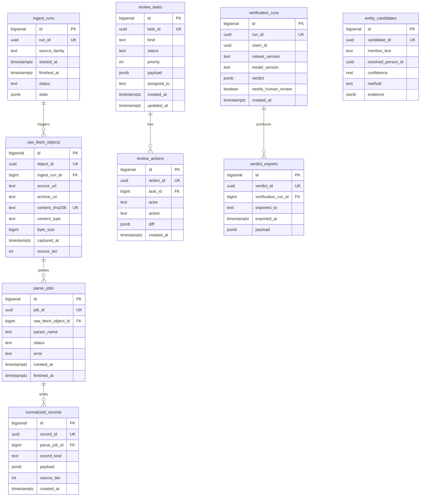
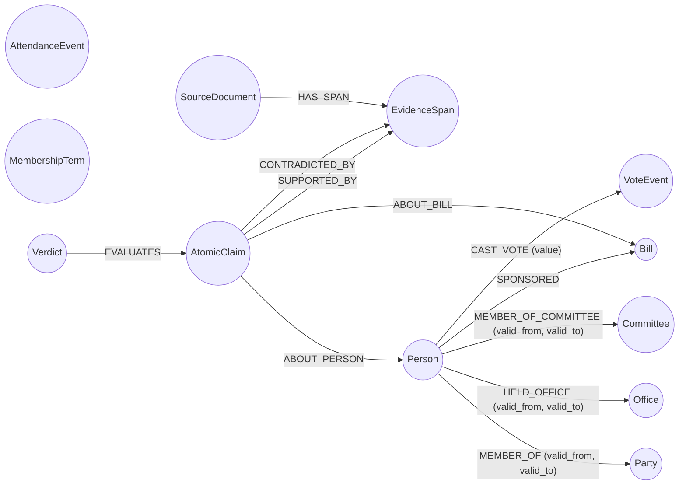

# Civic Proof IL — Canonical Data Model

> Phase 1. This document is the human-readable summary of the canonical data model. Schemas of record live in `data_contracts/jsonschemas/`, `infra/migrations/versions/0002_phase1_domain_schema.py`, `infra/neo4j/constraints.cypher`, and `infra/opensearch/templates/`.

## Responsibilities split

- **Postgres** owns ingest/review/verify pipelines (operational state).
- **Neo4j** owns canonical domain facts (People, Parties, Offices, Votes, etc.).
- **OpenSearch** is a cache + search index, NOT a system of record.
- **MinIO** holds immutable archive objects keyed by SHA-256 content hash.

## PostgreSQL ERD

Nine tables, keyed by surrogate `BIGSERIAL id` + canonical `<entity>_id UUID UNIQUE`. FKs only follow the operational pipeline (ingest → parse → normalize; review task → action; verification run → export). Domain facts live in Neo4j, not in these tables.

## Neo4j schema

Twelve nodes, eleven relationships. Business keys are UUID4 strings; node identity is enforced by `REQUIRE n.<entity>_id IS UNIQUE` + `IS NOT NULL` constraints. Relationship property existence (e.g. `valid_from`) is enforced inside upsert templates because Neo4j 5 community cannot declare it as a constraint.

`AttendanceEvent` and `MembershipTerm` are event-style nodes carrying per-event payloads. Their primary fan-in from `Person` lands in Phase 2 alongside ingestion adapters; Phase 1 only defines the node identity and unique constraints.

## OpenSearch indexes

Three templates. Field names mirror the corresponding JSON Schema contracts 1:1 so OpenSearch can be rebuilt from Neo4j + MinIO at any time.

- `source_documents` — fields: `document_id`, `source_family`, `source_tier`, `source_type`, `url`, `archive_uri`, `content_sha256`, `language`, `captured_at`, `title`, `body`.
- `evidence_spans` — fields: `span_id`, `document_id`, `source_tier`, `source_type`, `url`, `archive_uri`, `text`, `char_start`, `char_end`, `captured_at`.
- `claim_cache` — fields: `claim_id`, `raw_text`, `normalized_text`, `claim_type`, `speaker_person_id`, `target_person_id`, `bill_id`, `committee_id`, `office_id`, `vote_value`, `time_scope.start`, `time_scope.end`, `time_scope.granularity`, `checkability`, `created_at`.

Hebrew analyzer is not shipped with OpenSearch 2 by default; mappings on text fields use `standard` analyzer today with a hook to drop in a custom Hebrew analyzer in Phase 2+.

## Archive URI convention

See [docs/conventions/archive-paths.md](conventions/archive-paths.md).

TL;DR: `s3://<MINIO_BUCKET_ARCHIVE>/<source_family>/<YYYY>/<MM>/<DD>/<sha256>.<ext>`. Content-addressed, immutable, keyed by SHA-256 over raw bytes, with `source_family` restricted to the Phase-0 ingestion families (`gov_il`, `knesset`, `elections`).

## Cross-store ID mapping

Every entity has a single canonical UUID4 that is the same across stores. Postgres rows carry the UUID in JSONB payloads (not as a dedicated column at the domain level — domain facts live in Neo4j); Neo4j nodes use it as the property business key; OpenSearch uses it as `_id` and as the corresponding foreign field; archive objects do not carry entity UUIDs (they are keyed by content hash).

- **Person** — business key `person_id` (UUID4). Postgres: `normalized_records.payload->>'person_id'`, `entity_candidates.resolved_person_id`. Neo4j: `:Person {person_id}`. OpenSearch: `claim_cache.speaker_person_id`, `claim_cache.target_person_id`. Archive: not applicable.
- **Office** — business key `office_id` (UUID4). Postgres: `normalized_records.payload->>'office_id'`. Neo4j: `:Office {office_id}`. OpenSearch: `claim_cache.office_id`. Archive: not applicable.
- **Party** — business key `party_id` (UUID4). Postgres: `normalized_records.payload->>'party_id'`. Neo4j: `:Party {party_id}`. OpenSearch: not indexed in Phase 1 (can be added to a `party_cache` later if needed). Archive: not applicable.
- **Committee** — business key `committee_id` (UUID4). Postgres: `normalized_records.payload->>'committee_id'`. Neo4j: `:Committee {committee_id}`. OpenSearch: `claim_cache.committee_id`. Archive: not applicable.
- **Bill** — business key `bill_id` (UUID4). Postgres: `normalized_records.payload->>'bill_id'`. Neo4j: `:Bill {bill_id}`. OpenSearch: `claim_cache.bill_id`. Archive: not applicable.
- **VoteEvent** — business key `vote_event_id` (UUID4). Postgres: `normalized_records.payload->>'vote_event_id'`. Neo4j: `:VoteEvent {vote_event_id}`. OpenSearch: not indexed in Phase 1. Archive: not applicable.
- **MembershipTerm** — business key `membership_term_id` (UUID4). Postgres: `normalized_records.payload->>'membership_term_id'`. Neo4j: `:MembershipTerm {membership_term_id}`. OpenSearch: not indexed in Phase 1. Archive: not applicable.
- **SourceDocument** — business key `document_id` (UUID4). Postgres: `normalized_records.payload->>'document_id'`; the raw bytes behind the document are referenced by `raw_fetch_objects.archive_uri` (not the document UUID). Neo4j: `:SourceDocument {document_id}`. OpenSearch: `source_documents._id = document_id`, `evidence_spans.document_id`, `claim_cache` does not reference it directly. Archive: the underlying bytes live at the `archive_uri` keyed by SHA-256; the document UUID is the domain identity, the SHA-256 is the byte identity.
- **EvidenceSpan** — business key `span_id` (UUID4). Postgres: `normalized_records.payload->>'span_id'`. Neo4j: `:EvidenceSpan {span_id}`. OpenSearch: `evidence_spans._id = span_id`. Archive: not applicable (span text is a substring of an already-archived document).
- **AtomicClaim** — business key `claim_id` (UUID4). Postgres: `verification_runs.claim_id`. Neo4j: `:AtomicClaim {claim_id}`. OpenSearch: `claim_cache._id = claim_id`. Archive: not applicable.
- **Verdict** — business key `verdict_id` (UUID4). Postgres: `verdict_exports.verdict_id`, `verification_runs.verdict->>'verdict_id'`. Neo4j: `:Verdict {verdict_id}`. OpenSearch: not indexed in Phase 1 (verdicts are served via API, cached in Postgres exports). Archive: not applicable.

## JSON Schema contracts

Canonical schemas are under `data_contracts/jsonschemas/` (JSON Schema Draft 2020-12). Pydantic v2 models in `packages/ontology/src/civic_ontology/models/` are the single source of truth; the committed JSON Schemas are regenerated from those models and drift is enforced by `python -m civic_ontology.schemas --check`.

## Links

- [v1 plan](political_verifier_v_1_plan.md)
- [ADR-0001 — canonical data model](adr/0001-canonical-data-model.md)
- [Archive path convention](conventions/archive-paths.md)
